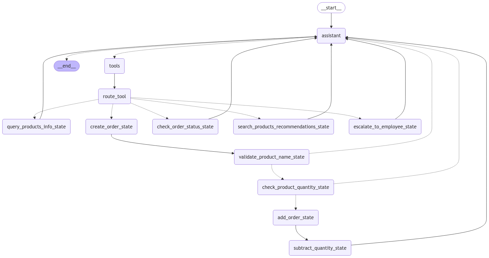

# Vendedor Virtual com LangChain e LangGraph via Streamlit



## Objetivo

Desenvolver um vendedor virtual que interaja com clientes via Streamlit, utilizando **LangChain**, **LangGraph** e um banco de dados SQLite fornecido. O bot deve responder a perguntas sobre produtos, estoque, pedidos e oferecer sugestões personalizadas com base no histórico do cliente.

---

## Funcionalidades do Projeto

### 1. **Consulta de Produtos**
- O cliente pode perguntar sobre produtos disponíveis, preços e estoque.
- **Exemplos:**
  - “Quais são os produtos disponíveis?”
  - “Qual o preço do produto X?”

### 2. **Criação de Pedidos**
- Permitir que os clientes criem pedidos a partir dos dados disponíveis no banco de dados.
- **Exemplo:** “Quero comprar 5 unidades do produto Y”.

### 3. **Consulta de Pedidos**
- Permitir que os clientes consultem o status de pedidos anteriores.
- **Exemplo:** “Qual é o status do meu pedido #12345?”

### 4. **Sugestões Personalizadas**
- Oferecer recomendações de produtos com base no histórico de pedidos do cliente.
- **Exemplo:** “Baseado na sua última compra, recomendamos o produto Z”.

### 5. **Escalonamento para Atendente Humano**
- Permitir que os clientes solicitem atendimento humano.
- **Exemplo:** “Eu gostaria de conversar com um atendente humano”.

---

## Requisitos Técnicos

### **Banco de Dados**
O projeto utiliza o banco de dados SQLite Chinook, que pode ser acessado em: [SQLite Sample Database](https://www.sqlitetutorial.net/sqlite-sample-database/).

O bot deve consultar e manipular as seguintes tabelas:
- **Customers**: Buscar informações sobre clientes.
- **Products**: Listar produtos disponíveis.
- **Orders** e **OrderDetails**: Gerenciar pedidos.
- **Employees**: Simular atendimento personalizado.

### **Tecnologias Utilizadas**
- **LangChain**: Orquestração da lógica de interação do bot.
- **LangGraph**: Criação e manipulação do fluxo de diálogo.
- **SQLite**: Banco de dados relacional.
- **Streamlit**: Interface de demonstração (simulada, se necessário).

---

## Estrutura do Projeto

```plaintext
.
├── database/
│   ├── db/
│   │   ├── chinook.db            # Banco de dados Chinook
│   │   ├── products.json         # Dados de produtos que serão usados no bot
│   │   └── schemas.sql           # Definições de esquemas em SQL
│   ├── utils/
│   │   ├── __init__.py           # Inicialização do módulo utils
│   │   └── database_functions.py # Funções relacionadas ao banco de dados
│   └── setup_database.py         # Script para configurar o banco de dados
├── streamlit/
│   └── app.py                    # Interface de demonstração com Streamlit
├── virtual_sales_agent/
│   ├── nodes/
│   │   ├── __init__.py                   # Inicialização do módulo nodes
│   │   ├── assistant.py                  # Lógica principal do assistente
│   │   ├── check_order_status_node.py    # Verificar o status de pedidos
│   │   ├── create_order_node.py          # Criar novos pedidos
│   │   ├── escalate_to_employee_node.py  # Lógica para escalonamento
│   │   ├── query_products_node.py        # Consulta de produtos
│   │   ├── recommend_product_node.py     # Lógica de recomendação de produtos
│   │   ├── routing_functions.py          # Lógica de roteamento
│   │   └── state.py                      # Gerenciamento de estado persistente
│   ├── graph.py                  # Manipulação de diálogos com LangGraph
│   ├── prompts.py                # Modelos de prompts para LangChain
│   ├── tools.py                  # Ferramentas do agente
│   └── utils_functions.py        # Funções utilitárias do agente
├── env-example                   # Exemplo de arquivo .env
├── requirements.txt              # Dependências do projeto
├── README.md                     # Documentação do projeto
└── graph.png                     # Diagrama do fluxo de interação
```

---

## Configuração do Ambiente

### **1. Pré-requisitos**
- Python 3.12 ou superior.
- Ambiente virtual configurado com `venv`.

### **2. Instalação**
1. Clone o repositório:
   ```bash
   git clone https://github.com/lucasboscatti/virtual-sales-agent-langgraph.git
   cd vendedor-virtual
   ```

2. Crie e ative o ambiente virtual:
   ```bash
   python3 -m venv venv
   source venv/bin/activate  # Para Linux/Mac
   venv\Scripts\activate  # Para Windows
   ```

3. Instale as dependências:
   ```bash
   pip install -r requirements.txt
   ```

4. Configure o as variáveis de ambiente
   - Substitua o arquivo `.env-example` por `.env` e preencha as variáveis necessárias.
   - Neste projeto foi utilizado os modelos Llama3 hospeados pela plataforma [groq](https://groq.com/).
        - Crie uma conta no site e obtenha a chave `GROQ_API_KEY`.
   - Para monitoramento do fluxo de interação do agente, foi utilizado a plataforma [Smith](https://smith.langchain.com/).
        - Crie uma conta no site e obtenha a chave `LANGCHAIN_API_KEY`.
   - Exporte as variáveis de ambiente:
        ```bash
        export GROQ_API_KEY=...
        export LANGCHAIN_API_KEY=...
        export LANGCHAIN_TRACING_V2=true
        export LANGCHAIN_ENDPOINT=https://api.smith.langchain.com
        export LANGCHAIN_PROJECT=virtual-sales-agent
        ```

5. [OPCIONAL] O banco já está baixado e configurado, caso contrário, execute o script:
    ```bash
    python3 database/setup_database.py
    ```

5. Execute a aplicação de demonstração:
   ```bash
   streamlit run streamlit/app.py
   ```

---